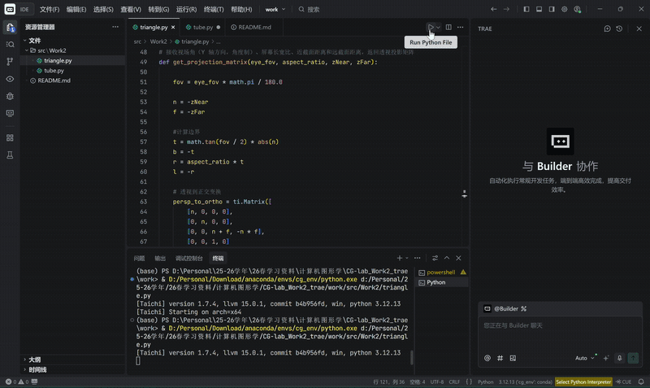
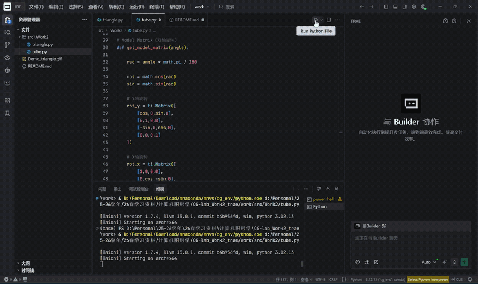

实验二：旋转与变换
#项目介绍

本实验实现了一个基于Taichi框架的三维图形渲染示例，通过手动构建 模型变换（Model）、视图变换（View）和投影变换（Projection）矩阵，将三维空间中的三角形顶点映射到二维屏幕坐标，并在 GUI 窗口中绘制出线框三角形。

实验的核心目标是理解 MVP（Model-View-Projection）变换流程。在计算机图形学中，三维模型需要经过一系列坐标变换，才能最终显示在屏幕上。该流程包括：

模型变换（Model Transformation）：将物体从模型坐标系变换到世界坐标系。

视图变换（View Transformation）：将世界坐标转换到相机坐标系。

投影变换（Projection Transformation）：将三维场景映射到二维视图平面。

在本实验中，程序首先定义三角形的三个顶点，然后通过构造 MVP 矩阵对顶点进行变换，并通过透视除法（Perspective Divide）将顶点归一化到标准设备坐标。最后将该坐标映射到GUI窗口坐标并绘制线框三角形。

程序运行后会生成一个700×700的GUI窗口，用户可以通过键盘控制三角形绕Z轴旋转，从而直观观察模型变换的效果。

##项目架构

###目录结构

project_root/

│

├── src/

│   └── Work2/

│       ├── triangle.py

│       └── tube.py

│

├── Demo_triangle.gif

├── Demo_tube.gif

├── README.md

└── .gitignore

##代码逻辑

###1.初始化环境、定义三角形

在main.py中，首先初始化Taichi计算环境，并采用齐次坐标形式定义三角形的三个顶点。

备注：齐次坐标可以统一表示平移、旋转和缩放变换，是计算机图形学中常用的表示方式。

###2.构建模型变换矩阵函数

此函数接收用户输入的旋转角度，返回一个变换矩阵用于对三角形进行旋转变换计算，使三角形绕Z轴旋转指定角度。

变换矩阵定义为

\begin{bmatrix}
cos & sin & 0 & 0\\
-sin & cos & 0 & 0\\
0 & 0 & 1 & 0\\
0 & 0 & 0 & 1
\end{bmatrix}

该矩阵会使三角形绕Z轴旋转，应用中可通过不断获取用户输入的旋转角度对三角形进行持续的旋转变换更新，从而实现动画效果。

###2.构建视图矩阵函数

此函数用于模拟相机的位置变化。

在计算机图形学中通常假设相机位于原点（0，0），朝向Z轴负方向。因此若真实相机的位置不在原点，则需要将整个世界向相机位置的反方向平移。

视图矩阵定义为
\begin{bmatrix}
1 & 0 & 0 & -x\\
0 & 1 & 0 & -y\\
0 & 0 & 1 & -z\\
0 & 0 & 0 & 1
\end{bmatrix}

其中(x,y,z)是相机的位置坐标。

###3.构建投影矩阵函数

投影矩阵函数接收视场角（Y 轴方向，角度制）、屏幕长宽比、近截面距离和远截面距离，返回透视投影矩阵，用于将三维空间投影到二维平面。具体的透视投影计算分为两步，首先要将相机的视锥体转换为长方体，然后通过正交投影矩阵将长方体进行缩放和平移，最后再通过线性映射将长方体映射到屏幕坐标。

##实现功能

###1. 三维三角形渲染

程序在三维空间中定义三角形，并通过 MVP 变换将其映射到二维屏幕，从而实现基本的三维图形显示。

###2. MVP 变换流程实现

程序完整实现了图形学中的标准变换流程：

        Model → View → Projection → NDC → Screen

通过代码手动构建各个变换矩阵，加深了对三维图形变换原理的理解。

###3. 交互式旋转控制

用户可以通过键盘控制三角形旋转：

        A 键：逆时针旋转

        D 键：顺时针旋转

从而动态观察模型变换的效果。

###实验结果展示

##选做内容
###构建3D立方体并进行透视旋转

目前上述程序中只绘制了一个扁平的三角形。为了真正展现视图变换的三维空间感，尝试将二维的三角形升级为真正的三维立体几何体并实现双轴旋转。

基于此目标，我们在代码中定义一个三维正方体（Cube）。正方体有 8 个顶点和 12 条边，中心放置在原点 (0, 0, 0)，边长为 2（即顶点坐标在 [-1, 1] 之间）。修改渲染逻辑后，将原本用于三角形的循环绘制逻辑，修改为遍历正方体的 12 条边进行线框绘制。

###实验结果展示

